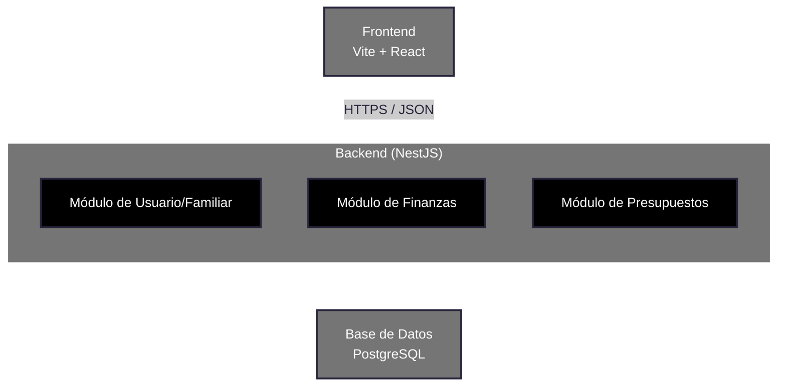

# Arquitectura de software

## Justificacion

### Arquitectura: Modelo de tres capas
Elegimos un modelo de tres capas (Presentación, Aplicación y Datos) con un backend estructurado como Monolito Modular. Esta decisión se fundamenta en los requisitos extrafuncionales priorizados para la gestión financiera:

#### Seguridad (Requisito de Prioridad Alta)
Dado que el sistema maneja datos de ingresos, egresos y estructuras familiares, la seguridad es crítica. Un monolito modular centraliza la autenticación y el control de acceso en un único punto de entrada (NestJS), facilitando la implementación de cifrado de datos y validación de sesiones para evitar que la información financiera se filtre entre distintos grupos familiares.

#### Recuperabilidad (Requisito de Prioridad Alta)
En finanzas, un error de cálculo o una pérdida de datos es inaceptable. La arquitectura asegura que cada transacción sea atómica a través de PostgreSQL. Si ocurre un fallo durante el registro de un gasto, el sistema garantiza la recuperación al estado previo (rollback), manteniendo la consistencia de los balances y presupuestos.

#### Mantenibilidad (Requisito de Prioridad Media)
La separación en módulos independientes (Usuario, Finanzas, Presupuestos) permite que el código sea fácil de entender y escalar. Si en el futuro se desea cambiar la lógica de cálculo de presupuestos o añadir integraciones bancarias, se puede hacer modificando un solo módulo sin riesgo de afectar la integridad del registro de transacciones.

#### Portabilidad (Requisito de Prioridad Media)
Al utilizar una capa de presentación basada en Vite + React y una comunicación vía HTTPS/JSON, el sistema garantiza que la experiencia del usuario sea consistente tanto en navegadores de escritorio como en dispositivos móviles, permitiendo el registro de gastos en cualquier lugar.

## Definición de Módulos
### Módulo de Usuario/Familiar
#### Responsabilidad:
- Gestión de identidad y autenticación de usuarios individuales.
- Administración de estructuras de Grupo Familiar, permitiendo la vinculación de múltiples cuentas a un mismo entorno financiero.
- Control de permisos y roles dentro de la familia (quién puede ver, editar o borrar gastos).
#### Datos que maneja:
- USUARIO: id, email, password (hash), nombre, fecha_registro, estado.
- GRUPO_FAMILIAR: id, nombre_familia, fecha_creacion.
- MEMBRESIA: id_usuario, id_grupo, rol (Administrador, Miembro, Observador).
- CONFIGURACIÓN: Moneda preferida, alertas de seguridad, preferencias de visualización.
#### Interacción con otros módulos:
- Con Finanzas: Proporciona el contexto de propiedad. Cada gasto registrado debe estar vinculado a un id_usuario y, opcionalmente, a un id_grupo.
- Con Presupuestos: Filtra los límites establecidos para que correspondan únicamente al grupo familiar activo.

### Módulo de Finanzas
#### Responsabilidad:
- Gestión completa del ciclo de vida de las transacciones (CRUD de Ingresos y Egresos).
- Categorización de movimientos y gestión de cuentas (Efectivo, Banco, Tarjeta).
- Cálculo de balances históricos y filtrado de movimientos por fechas o categorías.

#### Datos que maneja:
- TRANSACCIÓN: id, monto, fecha, descripción, tipo (ingreso/egreso), id_usuario, id_categoria, id_cuenta.
- CATEGORÍA: id, nombre (ej. Comida, Alquiler), icono, tipo_gasto (fijo/variable).
- CUENTA: id, nombre_cuenta, saldo_inicial, saldo_actual, moneda.

#### Interacción con otros módulos:
-Con Usuario: Verifica que el usuario tenga permisos de escritura en la cuenta o grupo familiar antes de guardar.
-Con Presupuestos: Notifica cada nuevo gasto registrado para que el presupuesto mensual se actualice y se reste del disponible.

### Módulo de Presupuestos

#### Responsabilidad:
- Definición y seguimiento de límites de gasto por categoría o periodo mensual.
- Monitorización de Metas de Ahorro y progreso de cumplimiento.
- Generación de alertas de sobregiro basadas en el gasto real reportado por el Módulo de Finanzas.

#### Datos que maneja:
- PRESUPUESTO: id, id_categoria, monto_limite, periodo (mes/año), id_grupo.
- META_AHORRO: id, nombre_meta, monto_objetivo, monto_actual, fecha_limite.
- ALERTA: id, mensaje, porcentaje_activacion (ej. 80%), estado_notificacion.

#### Interacción con otros módulos:
- Escucha de Finanzas: Cada vez que se confirma un gasto en el Módulo de Finanzas, este módulo recalcula automáticamente cuánto queda del presupuesto.
- Consulta de Usuario: Envía datos de progreso y estados de metas de ahorro para ser visualizados en el dashboard del perfil del usuario.
