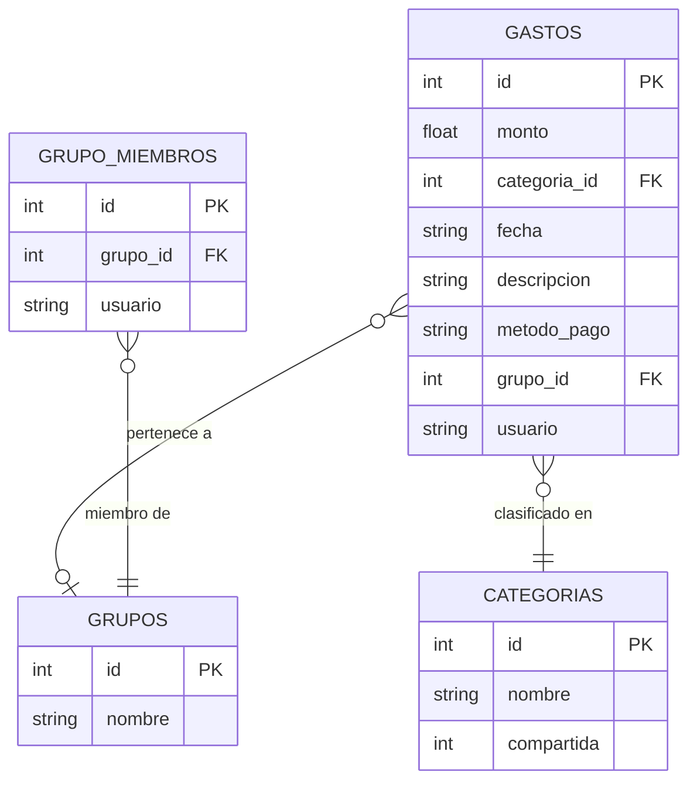
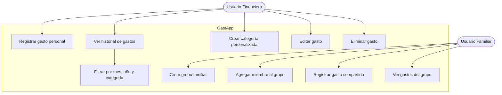
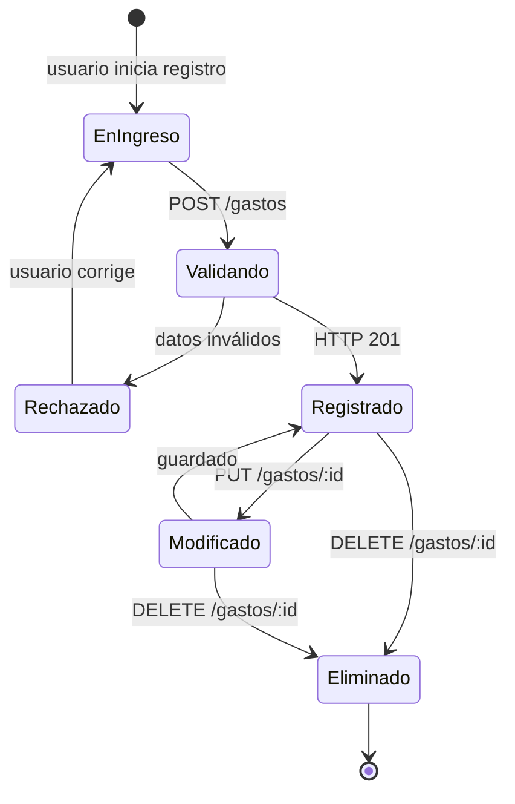
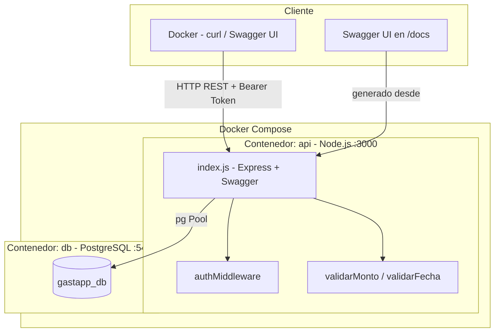
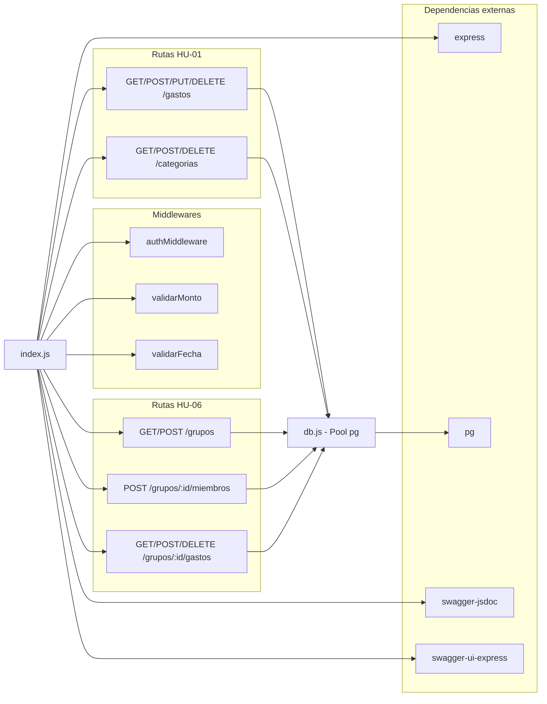
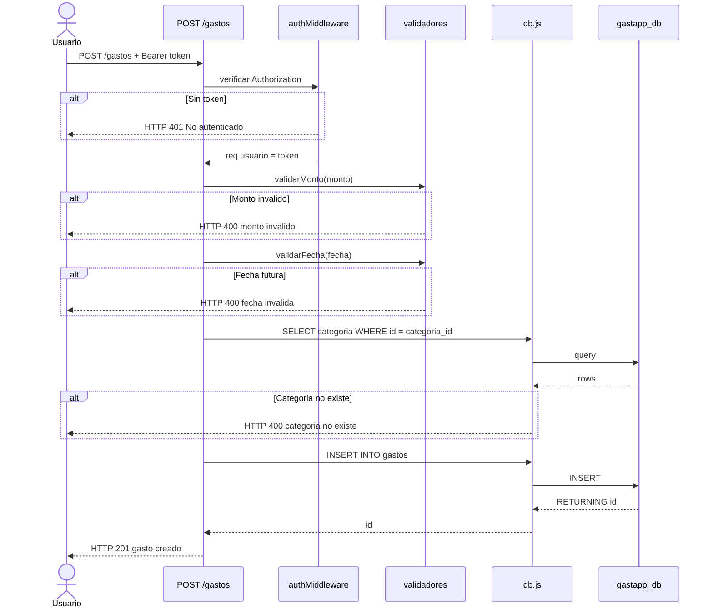

# Diagramas GastApp – Entrega 3

## 1. Modelo de Dominio

---

## 2. Diagrama de Casos de Uso

---

## 3. Diagrama de Estados – Gasto

---

## 4. Diagrama de Despliegue y Componentes

---

## 5. Diagrama de Componentes (Dependencias e Interfaces)

---

## 6. Diagrama de Secuencia – Registrar Gasto Personal (HU-01 CA1)

